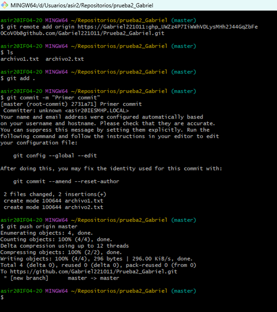

# Título Principal

## Subtítulo

Este es el ***ejemplo*** de *texto* escrito en **código**

`Este texto aparecerá como un codigo`

1. Primer elemento de la lista
2. Segundo elemento de la lista 
3. Tercer elemento de la lista

* Primer elemento desordenado
* Segundo elemento desordenado
* Tercer elemento desordenado

[URL_Externa](https://docs.github.com/es/rest/guides/ "Un enlace a una guia de documentacion de GitHub")

[URL_Markdown](ejercicio1.md/ "Enlace a un fichero Markdown de el repositorio")

|Lunes|Martes|Miécoles|Jueves|Viernes|
|Lengua|Mates|Lengua|IAW|Inglés|
|4H|3H|2H|2H|1H|