# Documentación del Ejercicio 3

## Paso 1

Para empezar con git branch comprobamos las ramas que tenemos creadas y nos saldrá que nos encontramos en master. Ahora tenemos que crear una nueva rama llamada Primera con el comando indicado y volvemos a comprobar las ramas que tenemos, pudiendo ver que sale la rama creada.

## Paso 2 
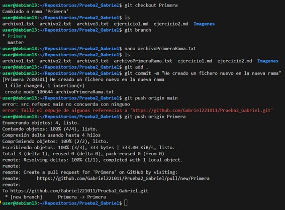

Ahora despues de crear la nueva rama y estar dentro de ella con git checkout Primera, creamos dentro de esta un nuevo archivo llamado archivoPrimeraRama.txt y hacemos la confirmacion con el git add ., git commit y git push origin Primera (El nombre de la rama ya no es master por que estamos en la nueva rama).

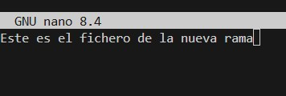

Aqui podemos ver el texto que hemos puesto en el archivo creado

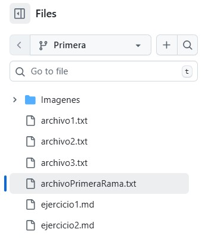

Y ahora podemos comprobar en el github cambiando a la rama primera que se han subido los cambios y que tenemos lo mismo que en la rama master mas el nuevo archivo creado

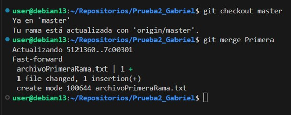

Ya por último, nos volvemos a cambiar a la rama master, y hacemos un git merge Primera, para fusionar la rama master con la rama Primera. Podremos comprobar con un ls que en la rama master tambien se encuentra el archivo de la rama Primera

## Paso 3

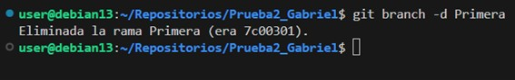

Ahora tenemos que borrar la rama Primera, con el comando indicado en la captura (git branch -d Primera)

## Paso 4

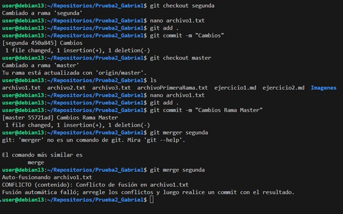

Ahora tenemos que crear una nueva rama llamada Segunda y meternos dentro de ella, luego modificamos por ejemplo el archivo1.txt y confirmamos los cambios sin subirlos al github, es decir sin hacer el git push. Y volvemos a hacer lo mismo pero en la rama Master, es decir, nos cambiamos de rama, y modificamos otra vez el archivo1.txt pero con otro texto y volvemos a confimar los cambios sin subirlos al github. Por último, desde la rama Master hacemos el git merge Segunda para fusionar las ramas, podremos ver que nos ha salido un conflicto, esto se debe a que has dos archivos iguales pero con distinto contenido en las dos ramas, lo que produce un conflicto.

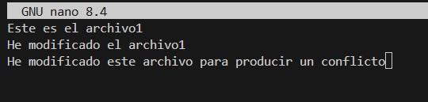

Este es texto que he cambiado en el archivo1.txt de la rama Segunda

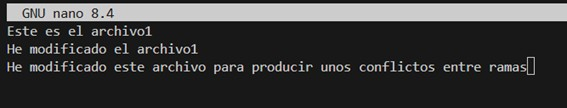

Este es el texto que he cambiado en el archivo1.txt de la rama Master

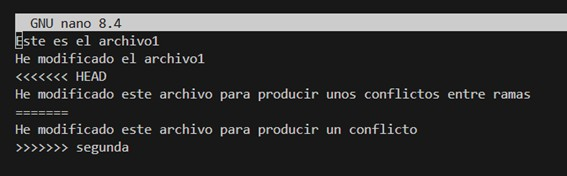

Si nos metemos en el archivo1.txt desde cualquier rama, podemos ver que nos muestra el conflicto.

## Paso 5

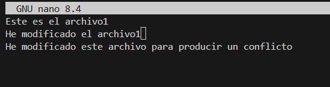

Para resolver el conflicto, debemos de borrar uno de los dos textos donde se encuentra el conflicto, con hacerlo solo en una rama nos valdría.

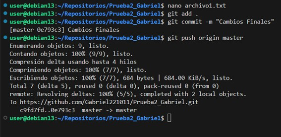

Despues confirmamos los cambios y esta vez si que hacemos el git push origin en este caso Master.

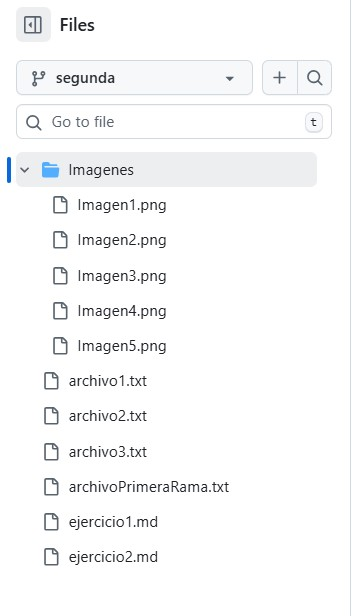

Y comprobamos que en el github ya no existe el conflicto y vemos los dos archivos en las dor ramas totalmente iguales.