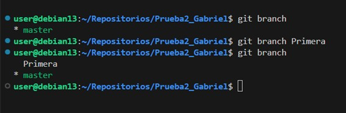

# Documentación del Ejercicio 3

## Paso 1

Para empezar con git branch comprobamos las ramas que tenemos creadas y nos saldrá que nos encontramos en master. Ahora tenemos que crear una nueva rama llamada Primera con el comando indicado y volvemos a comprobar las ramas que tenemos, pudiendo ver que sale la rama creada.