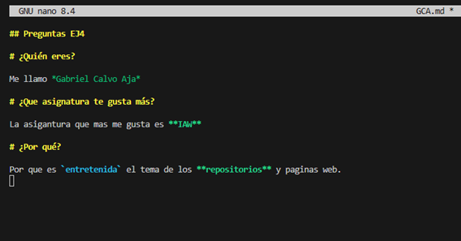

# Documentación del Ejercicio 4

## Paso 1

Despues de clonar el repositorio, tenemos que crear dentro de la carpeta Files, un archivo markdown que se llame con nuestras iniciales, y dentro de el responderemos a tres preguntas usando al menos cinco funciones del markdown.

## Paso 2

Ahora dentro del archivo README.md lo modificamos y ponemos el enlace con nuestras iniciales al archivo de la carpeta file que hemos creado antes. Y subiremos los cambios con el git add ., git commit -m y el git push origin master.

## Paso 3

Despues en Github, podemos ver que aparece nuestro enlace en el archivo README.md

## Paso 4

Ahora debemos crear un pull request al profesor enviando un commit significativo para que sepa que es nuestro.

## Paso 5

Una vez que el profesor nos acepta el pull request, le tenemos que dar al boton de sync fork para ver los cambios de los compañeros.